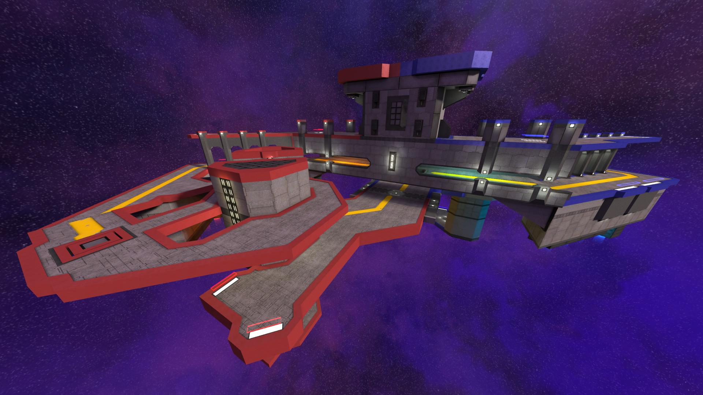
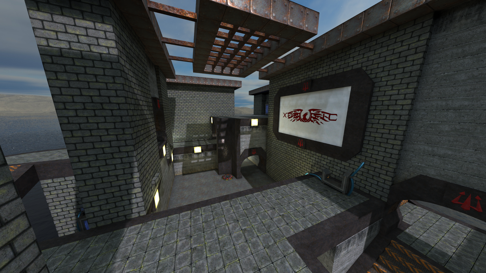

<!-- https://gohugo.io/content-management/summaries/ -->

Xonotic 0.8.6 is here at last! Bla, bla, bla...

<!--more-->

[Download it here](/download) or [upgrade from an older version](/download/#upgrading).

---

### Artwork

#### Maps
- New official maps:
  - [Go] by *dublpaws* and *Debugger*, a space CTF map with a futuristic theme! (Author: Mirio) [43](https://gitlab.com/xonotic/xonotic-maps.pk3dir/-/merge_requests/43)

    
  *click to view full size*
  - [Trident] by *proraide*. Fight in an abandoned building! (Author: Amadeusz Sławiński) [169](https://gitlab.com/xonotic/xonotic-maps.pk3dir/-/merge_requests/169)

    
  *click to view full size*
- Removed Drain and Oil Rig. (Author: SpiKe) [161](https://gitlab.com/xonotic/xonotic-maps.pk3dir/-/merge_requests/161)
- Stormkeep: Fixed an invisible crouching spot near the Mega Health. (Author: SpiKe) [162](https://gitlab.com/xonotic/xonotic-maps.pk3dir/-/merge_requests/162)
- Implosion: Added flare lights on top of the radio pylons + clipped the walls in the corridors + brush and texture cleanups. (Author: SpiKe) [163](https://gitlab.com/xonotic/xonotic-maps.pk3dir/-/merge_requests/163)
- Added copies of crate and jumppad LOD models that work with automatic LOD loading. (Author: Mario) [165](https://gitlab.com/xonotic/xonotic-maps.pk3dir/-/merge_requests/165)
- Atelier: fixed players sometimes getting stuck by placing the teleporter exits slightly above the ground and making the decals underneath non-solid. (Author: SpiKe) [166](https://gitlab.com/xonotic/xonotic-maps.pk3dir/-/merge_requests/166)
- Updated map screenshots, removing old Nexuiz assets and not displaying items. (Author: LegendaryGuard) [168](https://gitlab.com/xonotic/xonotic-maps.pk3dir/-/merge_requests/168)
- Fixed wrong minimap scales on Dance, Implosion, Space-Elevator and Xoylent. (Author: SpiKe) [170](https://gitlab.com/xonotic/xonotic-maps.pk3dir/-/merge_requests/170)
- Added the Arc entity definition for mappers. (Author: SpiKe) [173](https://gitlab.com/xonotic/xonotic-maps.pk3dir/-/merge_requests/173)
- Updated entity definition bounding boxes to match 0.8.6 (for mappers). (Author: bones_was_here) [175](https://gitlab.com/xonotic/xonotic-maps.pk3dir/-/merge_requests/175)
- Bromine: disabled the grass shadows + minor fixes. (Author: SpiKe) [179](https://gitlab.com/xonotic/xonotic-maps.pk3dir/-/merge_requests/179)
- Rebuilt some maps with the new q3map2 default light settings. (Author: bones_was_here) [180](https://gitlab.com/xonotic/xonotic-maps.pk3dir/-/merge_requests/180) (_partially merged_)
- Fixed a few minor visual issues on Erbium, Opium and Solarium. (Author: SpiKe)
- Packaged a xoncompat repository containing assets from maps (Drain and Oil Rig) removed in this release. (Author: bones_was_here) [102](https://gitlab.com/xonotic/xonotic/-/merge_requests/102)

#### Monsters
- Added LOD models for the monsters to boost performance with lots of monsters in the map and fixed some LOD related bugs. (Author: Mario) [1069](https://gitlab.com/xonotic/xonotic-data.pk3dir/-/merge_requests/1069)

#### Weapons
- Optimized h_ok_grenade, h_ok_hmg, h_ok_mg, h_ok_rl and h_ok_sniper models to reduce file size. (Author: LegendaryGuard) [1106](https://gitlab.com/xonotic/xonotic-data.pk3dir/-/merge_requests/1106)
- Updated and optimized Akordeon, Devastator, Fireball, Tuba and Vortex v_* files, scaled by -15%. Fixed Fireball Gloss material, scaled Tuba UVs by -20% and scaled v_kleinbottle by -35%. (Author: LegendaryGuard) [1113](https://gitlab.com/xonotic/xonotic-data.pk3dir/-/merge_requests/1113)
- Optimized g_fireball and fixed g_fireball and v_fireball UVs and enhanced a few slight details in the Fireball's textures. (Author: LegendaryGuard) [1123](https://gitlab.com/xonotic/xonotic-data.pk3dir/-/merge_requests/1123)
- Fixed wrong Fireball having wrong player glow color. (Author: terencehill) [[cd6c2c93]](https://gitlab.com/xonotic/xonotic-data.pk3dir/-/commit/cd6c2c93684d30a3e2878d8f4d48875dcd4c1978)
- Fixed dropped weapons having wrong player glow color. (Author: terencehill) [[40b83807]](https://gitlab.com/xonotic/xonotic-data.pk3dir/-/commit/40b838075e618d6075fdaa25f2f00b223be3712e)
- Made Crylink's screen brighter. (Author: MusicGoat) [[4d874ab3]](https://gitlab.com/xonotic/xonotic-data.pk3dir/-/commit/4d874ab391add1ad554f777c2d8aaebbeec0ddcc)

#### Items
- Fixed the Invisibility and Speed powerups not displaying their 2D icons when the powerups aren't available for pickup. (Author: LegendaryGuard) [[aaec1d16]](https://gitlab.com/xonotic/xonotic-data.pk3dir/-/commit/aaec1d16f81e3217b5a67e3e1c7c03860d09cbcc)

---

### Gameplay

##### Mayhem
- Created the Mayhem and Team Mayhem gamemodes. (Author: Dr. Jaska) [884](https://gitlab.com/xonotic/xonotic-data.pk3dir/-/merge_requests/884)  
  Mayhem is a mode full of chaos and deathmatching where players respawn with all weapons and full health/armor stack!  
  In these gamemodes score is given 75% based on damage dealt and 25% based on frags.  
  In Free For All Mayhem the player (and in Team Mayhem the team) with the most damage dealt and frags earned at the end of a match wins!

##### Keepaway
- Added Team Keepaway. (Author: Mario) [1045](https://gitlab.com/xonotic/xonotic-data.pk3dir/-/merge_requests/1045)  
  Team Keepaway is the teamplay variant of Free For All Keepaway.  
  Points are awarded for each kill to the team in possession of the ball and for killing opposing teams' ball carriers!
<!--Fixes-->
- Fixed several Keepaway issues. (Author: bones_was_here) [1175](https://gitlab.com/xonotic/xonotic-data.pk3dir/-/merge_requests/1175)

##### Survival
- Added Survival, a gamemode where a few randomly selected hunters must frag all of the survivors without being identified and stopped. (Author: Mario) [1072](https://gitlab.com/xonotic/xonotic-data.pk3dir/-/merge_requests/1072)

##### Last Man Standing
- Implemented 4 new features for LMS. (Author: terencehill) [808](https://gitlab.com/xonotic/xonotic-data.pk3dir/-/merge_requests/808)
- Players are now allowed to get back into the game if they moved to spectator. (Author: terencehill) [1051](https://gitlab.com/xonotic/xonotic-data.pk3dir/-/merge_requests/1051)

##### Map Entities
- Fixes for teamed items and Quake 3 compatibility. (Author: bones_was_here) [1079](https://gitlab.com/xonotic/xonotic-data.pk3dir/-/merge_requests/1079)
- Fixed blocking of moving map entities with a BSP model being broken. (Author: terencehill) [1092](https://gitlab.com/xonotic/xonotic-data.pk3dir/-/merge_requests/1092)

##### Physics
- Added Quake 3 jump pad trajectory compatibility. (Author: Juhu) [1134](https://gitlab.com/xonotic/xonotic-data.pk3dir/-/merge_requests/1134)

##### Mutators
- Allowed dropping powerups with the use key and fixed powerups dropping outside of the map. (Author: z411) [1074](https://gitlab.com/xonotic/xonotic-data.pk3dir/-/merge_requests/1074)
<!--Fixes-->
- Fixed a few issues with instagib/LMS items and in particular extralife. (Author: terencehill) [1164](https://gitlab.com/xonotic/xonotic-data.pk3dir/-/merge_requests/1164)
- Fixed Extralife pickup sound canceling long powerup sounds and improved instagib powerup replacement system. (Author: terencehill) [1174](https://gitlab.com/xonotic/xonotic-data.pk3dir/-/merge_requests/1174)
- Fixed pokenades causing a crash when monsters are disabled. (Author: Mario) [1041](https://gitlab.com/xonotic/xonotic-data.pk3dir/-/merge_requests/1041)

##### Freeze Tag
- Armor, ammo and weapons are no longer reset when a player is gibbed, for example for players falling into the void. (Author: terencehill) [1179](https://gitlab.com/xonotic/xonotic-data.pk3dir/-/merge_requests/1179)

##### Capture the Flag
- Fixed not getting notifications in CTF if another team gets yet another team's flag in 3-4 team CTF. (Author: z411) [1087](https://gitlab.com/xonotic/xonotic-data.pk3dir/-/merge_requests/1087)

##### Physics
- Made all remaining entities use physics logic handled by QuakeC gamecode rather than the engine, allowing for future advancements in movement and gameplay. (Author: Mario) [1044](https://gitlab.com/xonotic/xonotic-data.pk3dir/-/merge_requests/1044)
- Implemented teleporter entity flags from Quake 3 DeFRaG. (Author: Juhu) [1135](https://gitlab.com/xonotic/xonotic-data.pk3dir/-/merge_requests/1135)
- Compensate for Quake 3 frametime-dependent gravity in configs and jump pad code. (Author: bones_was_here) [1138](https://gitlab.com/xonotic/xonotic-data.pk3dir/-/merge_requests/1138)

##### Clan Arena
- Created a new opt-in feature for fewer stalemates in CA when round timer runs out. (Co-Authors: Dr. Jaska & z411) [1068](https://gitlab.com/xonotic/xonotic-data.pk3dir/-/merge_requests/1068)
- Added a server-side option to disable dead players being able to spectate with freecam in Clan Arena (enabled by default only in XPM-ruleset). (Author: z411) [1081](https://gitlab.com/xonotic/xonotic-data.pk3dir/-/merge_requests/1081)

##### Balance
- Created the [Xonotic Balance Council](/balance_council/) responsible for future balance changes.
- Made the variables `g_*_weaponarena` no longer list servers as modified if they are set to `"most"` or `"most_available"`. (Author: Dr. Jaska) [1103](https://gitlab.com/xonotic/xonotic-data.pk3dir/-/merge_requests/1103)

##### Weapons
- Made Crylink full-auto instead of semi-automatic when it has only 1 spike (pellet). (Author: Dr. Jaska) [1153](https://gitlab.com/xonotic/xonotic-data.pk3dir/-/merge_requests/1153)
- Added overkill blaster keepforce and keepdamage cvars. (Author: bones_was_here) [1158](https://gitlab.com/xonotic/xonotic-data.pk3dir/-/merge_requests/1158)
<!--Fixes-->
- Fixed some Shotgun bugs related to bots or the weapon being reloadable. (Author: terencehill) [1061](https://gitlab.com/xonotic/xonotic-data.pk3dir/-/merge_requests/1061)
- Fixed inverted (lower value for core than outer edge) damage and edgedamage values for splash damage having completely wrong force calculations. (Author: Dr. Jaska) [1145](https://gitlab.com/xonotic/xonotic-data.pk3dir/-/merge_requests/1145)
- Fixed Crylink and Vaporizer being able to fire with empty magazines. (Author: Dr. Jaska) [1147](https://gitlab.com/xonotic/xonotic-data.pk3dir/-/merge_requests/1147)
- Fixed Arc not having a suicide death message. (Author: terencehill) [1032](https://gitlab.com/xonotic/xonotic-data.pk3dir/-/merge_requests/1032)

##### Monsters
- Added an off-switch for monster loot (`g_monsters_drop`). (Author: Dr. Jaska) [1162](https://gitlab.com/xonotic/xonotic-data.pk3dir/-/merge_requests/1162)

---

### User Interface

##### HUD
- Improved StrafeHUD a lot with many new features and bugfixes. (Author: Juhu) [1066](https://gitlab.com/xonotic/xonotic-data.pk3dir/-/merge_requests/1066)
- Made it possible to switch between the default quickmenu and a customized quickmenu, if one is provided by the server. (Author: terencehill) [1018](https://gitlab.com/xonotic/xonotic-data.pk3dir/-/merge_requests/1018)
- Allowed players to make the server's custom quickmenu default. (Author: terencehill) [1090](https://gitlab.com/xonotic/xonotic-data.pk3dir/-/merge_requests/1090)
- Added an option in HUD editor to show a line for centering panels. (Author: terencehill) [1157](https://gitlab.com/xonotic/xonotic-data.pk3dir/-/merge_requests/1157)
- Made the speed unit a global, consistent setting. (Author: z411) [1130](https://gitlab.com/xonotic/xonotic-data.pk3dir/-/merge_requests/1130)
- Improved duel centerprint title. (Author: terencehill) [1039](https://gitlab.com/xonotic/xonotic-data.pk3dir/-/merge_requests/1039)
- Made `moveto*` votes always show player ID and name, 2 other minor voting related fixes. (Author: terencehill) [1198](https://gitlab.com/xonotic/xonotic-data.pk3dir/-/merge_requests/1198)
- Cleaned up ammo sorting in the HUD to not reference items directly. (Author: Mario) [1121](https://gitlab.com/xonotic/xonotic-data.pk3dir/-/merge_requests/1121)

##### Scoreboard
- Implemented team selection in the scoreboard and added a scoreboard user interface (TAB-ESC to enter). (Author: terencehill) [1027](https://gitlab.com/xonotic/xonotic-data.pk3dir/-/merge_requests/1027)
- Made scoreboard pings colored! (Author: z411) [968](https://gitlab.com/xonotic/xonotic-data.pk3dir/-/merge_requests/968)  
  By default the best pings are green, decent pings are yellow, bad pings are orange, and the worst pings are red.
- Made showing the average scores per round in the scoreboard possible. (Author: terencehill) [975](https://gitlab.com/xonotic/xonotic-data.pk3dir/-/merge_requests/975)
- Created a new HUD panel that displays item pickups. (Author: z411) [1094](https://gitlab.com/xonotic/xonotic-data.pk3dir/-/merge_requests/1094)
<!--Fixes-->
- Fixed mismatching player sorting between server and client. (Author: terencehill) [1026](https://gitlab.com/xonotic/xonotic-data.pk3dir/-/merge_requests/1026)
- Disabled CTS recording damage taken and dealt. (Author: Dr. Jaska) [1025](https://gitlab.com/xonotic/xonotic-data.pk3dir/-/merge_requests/1025)
- Removed useless damage dealt, damage taken and ELO scoreboard columns from CTS. (Author: Dr. Jaska) [1030](https://gitlab.com/xonotic/xonotic-data.pk3dir/-/merge_requests/1030)

##### In-Game "Game" Menu (also called ESC or Pause menu)
- Added the `menu_gamemenu` client cvar to enable/disable the Game menu. (Author: z411) [1101](https://gitlab.com/xonotic/xonotic-data.pk3dir/-/merge_requests/1101)
- Fixed the welcome dialog popping up instead of the Game menu on the first ESC key press when replaying a demo. (Author: terencehill) [1058](https://gitlab.com/xonotic/xonotic-data.pk3dir/-/merge_requests/1058)
- Fixed Settings button in the Game menu opening a standard settings page. (Author: terencehill) [[d99f5ca5]](https://gitlab.com/xonotic/xonotic-data.pk3dir/-/commit/d99f5ca57c15cb2fa4735a1658a6e33fa0834017)

##### Voting Screens and Intermission
- Made the map voting screen's chosen levelshot expand to the center of the screen for a second before it is loaded. (Author: terencehill) [1060](https://gitlab.com/xonotic/xonotic-data.pk3dir/-/merge_requests/1060)
<!--Fixes-->
- Made 100% abstain votes in map voting choose a random map. (Author: Dr. Jaska) [1172](https://gitlab.com/xonotic/xonotic-data.pk3dir/-/merge_requests/1172)
- Fixed voting for `endmatch` successfully during an intermission skipping the next map and going into a random map. (Author: terencehill) [[22f4e736]](https://gitlab.com/xonotic/xonotic/-/commit/22f4e7369ad11646609c6420cba17d452e652c4b)
- Fixed not notifying about the vote in progress being canceled when the match ends. (Author: terencehill) [1181](https://gitlab.com/xonotic/xonotic-data.pk3dir/-/merge_requests/1181)
- Fixed crashes in map voting screen related to gametypes with low amount of supported maps. (Author: terencehill) [1188](https://gitlab.com/xonotic/xonotic-data.pk3dir/-/merge_requests/1188)
- Fixed `sv_vote_gametype_options` so that it defaults to the current gametype if it doesn't have a single valid gametype. (Author: Dr. Jaska) [1190](https://gitlab.com/xonotic/xonotic-data.pk3dir/-/merge_requests/1190)

##### Text
- Changed default font hinting to 2. (Author: bones_was_here) [1048](https://gitlab.com/xonotic/xonotic-data.pk3dir/-/merge_requests/1048)
- Added `%o` and `%O` to chat formatting so that players can easily check and/or tell their coordinates, e.g. check step height. (Author: Dr. Jaska) [1166](https://gitlab.com/xonotic/xonotic-data.pk3dir/-/merge_requests/1166)
<!--Fixes-->

##### Translations
- New localizations for Chinese (Hong Kong), Indonesian and Latin have been added to the User settings (thanks to our new translators).

---

### Campaign
The campaign has received an overhaul! There are many new levels and improvements. (Author: Dr. Jaska) [178](https://gitlab.com/xonotic/xonotic-maps.pk3dir/-/merge_requests/178)  

##### Updates {#}
- Level 09: Changed Erbium instagib to Darkzone.  
- Level 12: Changed Warfare Freeze Tag to Erbium.  
- Level 16: Changed Runningman Keepaway into Team Keepaway.  
- Level 18: Changed Bromine Deathmatch into Clan Arena.  
- Level 27: Added forced respawn and 5min timelimit to Fuse Duel.  
- Level 30: Changed from DM into Mayhem to avoid kill stealing.  

##### New levels {#}
- Level 03: A new easy Mayhem level early in the campaign.  
- Level 15: CTF in Go.  
- Level 21: Team Mayhem in Trident.  
- Level 23: Onslaught in Running Man.  
- Level 28: Vampire Mutator CA in Warfare.  
- Level 31: A brutal END GAME level of Free For All Mayhem with superbots for true veterans on Trident.

---

### Bots
- New extremely tough bots, superbots! (Author: Dr. Jaska) [1053](https://gitlab.com/xonotic/xonotic-data.pk3dir/-/merge_requests/1053)  
  These superbots have no aim limitations, actively dodge projectiles, strafe randomly while in combat  
  and prioritize low health targets instead of always targeting the closest opponent!  
  To opt in to these superbots set `skill` to `101` or any higher number, for toughest normal bots set `skill` to `100` or below.  
  Be warned that these bots are a real challenge to even the best veteran players.  
  For these bots to be fun it is recommended to not give superbots hitscan weapons like the Vortex.
<!--Fixes-->
- Improved bot aiming abilities and fixed several minor issues, including premature detonation of Devastator rockets. (Author: terencehill) [1063](https://gitlab.com/xonotic/xonotic-data.pk3dir/-/merge_requests/1063)
- Fixed bots being unable to fire fireball alt fire. (Author: Dr. Jaska) [1104](https://gitlab.com/xonotic/xonotic-data.pk3dir/-/merge_requests/1104)

---

### XonStat {#xonstat}
- Added support for the Mayhem, Team Mayhem, LMS, and Team Keepaway game modes.
- Endmatch reports now store anticheat telemetry to help identify suspicious behavior.
- Fixed the server identification routine to prefer active servers when duplicate hashkey entries are found.
- Defined an alpha version of a `balance` endpoint to provide the foundation for dynamic team balancing in the future.
- Fixed a bug where deactivated servers were still accessible in the UI.

---

### Moderation
- New banning systems and features for moderation purposes. (Author: LegendaryGuard) [945](https://gitlab.com/xonotic/xonotic-data.pk3dir/-/merge_requests/945)  
  In short, players are able to locally ignore someone's chat messages via `ignore #player_id`,  
  server admins and moderators can use `chatban #player_id` to prevent them from sending chat messages in any chat,  
  `voteban #player_id` to disallow them from voting and/or `playban #player_id` to force them to stay in spectator.  
  Checkout the new [moderation tools wiki page](https://gitlab.com/xonotic/xonotic/-/wikis/Moderation-tools) for more information!

---

### Visual Effects
- Changed HLAC's secondary attack to only play a single sound and muzzle flash effect when fired. (Author: Mario) [1040](https://gitlab.com/xonotic/xonotic-data.pk3dir/-/merge_requests/1040)
- Made Vortex's charging use the player's color instead of predefined colors. (Author: Mario) [1098](https://gitlab.com/xonotic/xonotic-data.pk3dir/-/merge_requests/1098)
- Tweaked gibs' settings to reduce exaggerated throw velocity. (Author: terencehill) [1114](https://gitlab.com/xonotic/xonotic-data.pk3dir/-/merge_requests/1114)
- Replaced the Disability buff's smoke effect, players that are hit by someone holding the Disability buff will have a new electricity effect. (Author: LegendaryGuard) [1062](https://gitlab.com/xonotic/xonotic-data.pk3dir/-/merge_requests/1062)
- Implement `cl_gunoffset` and casings-related fixes and refactoring. (Author: bones_was_here) [1100](https://gitlab.com/xonotic/xonotic-data.pk3dir/-/merge_requests/1100)
- Made `r_ambient` default to `0` instead of `4`, thus removing all ambient lighting. (Author: bones_was_here) [993](https://gitlab.com/xonotic/xonotic-data.pk3dir/-/merge_requests/993)
- Made CTF flags to be colored by gamecode instead of assets being colored. (Author: Mario) [1038](https://gitlab.com/xonotic/xonotic-data.pk3dir/-/merge_requests/1038)
<!--Fixes-->
- Fixed a few cases where particles and/or decals did not appear for some weapons at times. (Author: terencehill) [1112](https://gitlab.com/xonotic/xonotic-data.pk3dir/-/merge_requests/1112)
- Fixed 2 more decal related issues. (Author: terencehill) [1127](https://gitlab.com/xonotic/xonotic-data.pk3dir/-/merge_requests/1127)
- Smoothed the effect of `v_deathtiltangle`. (Author: terencehill) [[3389f6aa]](https://gitlab.com/xonotic/xonotic-data.pk3dir/-/commit/3389f6aa909c6a1d591a9622bb85e05b45b036c2)

---

### Settings
- Refined default values for mouse `sensitivity` (halved from 6 to 3) and master volume (9.0 to 7.0). (Author: Dr. Jaska) [1192](https://gitlab.com/xonotic/xonotic-data.pk3dir/-/merge_requests/1192)

---
### Map Entities
- Allowed mappers to define item skins. (Author: Mario) [1107](https://gitlab.com/xonotic/xonotic-data.pk3dir/-/merge_requests/1107)
<!--Fixes-->
- Fixed error spam which occurred when standing in the way of rotating doors. (Author: Mario) [1105](https://gitlab.com/xonotic/xonotic-data.pk3dir/-/merge_requests/1105)

---

### Game Logic
- Implemented announcer queue to prevent overlapping announcements. (Author: z411) [1075](https://gitlab.com/xonotic/xonotic-data.pk3dir/-/merge_requests/1075)
- Created new automatic per-map min & max player limits. Fixed many warmup, player count and Welcome dialog things. (Author: bones_was_here) [1022](https://gitlab.com/xonotic/xonotic-data.pk3dir/-/merge_requests/1022)
- Implemented `g_warmup` > 1 and related fixes and refactoring. (Author: bones_was_here) [1082](https://gitlab.com/xonotic/xonotic-data.pk3dir/-/merge_requests/1082)
- Made autopause work for dedicated servers and improved autopause for listen servers. (Author: bones_was_here) [1144](https://gitlab.com/xonotic/xonotic-data.pk3dir/-/merge_requests/1144)
<!--Fixes-->
- Fixed issues with dropped powerups by also deleting item waypoints when deleting their items. (Author: Mario) [1070](https://gitlab.com/xonotic/xonotic-data.pk3dir/-/merge_requests/1070)
- Fixed `weapon_shotgun` and `weapon_vortex` aliases missing. (Author: Mario) [1052](https://gitlab.com/xonotic/xonotic-data.pk3dir/-/merge_requests/1052)
- Fixed dedicated servers panicking when gotomap vote passes during an intermission. (Author: terencehill) [1055](https://gitlab.com/xonotic/xonotic-data.pk3dir/-/merge_requests/1055)
- Fixed demo camera's (`camera_enable 1` when replaying demos) jerky mouse movement. (Author: terencehill) [1151](https://gitlab.com/xonotic/xonotic-data.pk3dir/-/merge_requests/1151)
- Fixed `g_maplist_remove` completely breaking and always removing the 2nd option. (Author: Dr. Jaska) [1156](https://gitlab.com/xonotic/xonotic-data.pk3dir/-/merge_requests/1156)
- Fixed several minor issues. (Author: Mario) [1095](https://gitlab.com/xonotic/xonotic-data.pk3dir/-/merge_requests/1095)

---

### Map Compatibility
- Implemented compatibility for Quake 3 (and its mods) mapinfo file formats (e.g. .defi and .arena) to a degree. (Author: Mario) [856](https://gitlab.com/xonotic/xonotic-data.pk3dir/-/merge_requests/856)

---

### Behind the Scenes
- Added useful in-game tools for debugging. (Author: terencehill) [1152](https://gitlab.com/xonotic/xonotic-data.pk3dir/-/merge_requests/1152)
- The files in the release zips now have correct date modified metadata. (Author: bones_was_here) [[9a55f9d2]](https://gitlab.com/xonotic/xonotic/-/commit/9a55f9d2ad6b933f831236eaca2278ae0506ec7e)
- Added Overkill weaponry decompiled sources (Blender 2.79b source files) to mediasource repository and organized weapon directory structure to be similar to xonotic-data.pk3dir/models/weapons/. (Author: LegendaryGuard) [24](https://gitlab.com/xonotic/mediasource/-/merge_requests/24)
<!--Fixes-->
- Fixed error when unzipping `cygiconv-2.dll` with Windows Explorer. (Author: bones_was_here) [[9a55f9d2]](https://gitlab.com/xonotic/xonotic/-/commit/9a55f9d2ad6b933f831236eaca2278ae0506ec7e)
- Fixed URLs and syntax errors in AppData. (Author: AsciiWolf) [96](https://gitlab.com/xonotic/xonotic/-/merge_requests/96)
- Fixed make scripts failing with preset MAKEFLAGS which did not start with a dash. (Author: kiwixz) [97](https://gitlab.com/xonotic/xonotic/-/merge_requests/97)

---

### DarkPlaces Engine
- Increased the response buffer to allow listing more players in the in-game server browser. (Author: terencehill) [[1d7fd4d7]](https://gitlab.com/xonotic/darkplaces/-/commit/1d7fd4d72503aa1c8b6473cba0505373c15ac80e)
<!--Fixes-->
- Worked around various obscure bugs in physics and logic caused by GCC and Clang compilers optimizing incorrectly for CPUs with the AVX extension. (Author: bones_was_here)

---

### Utilities
- Created `misc/tools/fov-calc.py`, a utility python script for Field of View (FOV) calculating. (Author: Dr. Jaska) [98](https://gitlab.com/xonotic/xonotic/-/merge_requests/98)  
  Did you know that due to its legacy the DarkPlaces engine calculates actual FOV based on what your FOV would look like were you to have a 4:3 monitor?  
  This means that for example with a 16:9 your `fov 90` setting won't show 90 degrees horizontally but around 106 degrees.  
  There is now a utility tool for calculating your actual horizontal and vertical FOV on any resolution, with or without zoom scaling (e.g. Vortex's scope multiplier).  
  Fun fact: This FOV calculation behavior also exists in many other games like Counter Strike games and Half-Life games due to their shared roots of the Quake 1 game engine!

---

### Code Quality

##### Fixes
- Implemented safe removal of elements of an intrusive list while looping over them. (Author: terencehill) [1148](https://gitlab.com/xonotic/xonotic-data.pk3dir/-/merge_requests/1148)
- Added checks to make sure neither entity has been deleted when calling touch functions. (Author: Mario) [1139](https://gitlab.com/xonotic/xonotic-data.pk3dir/-/merge_requests/1139)
- Fixes for WarpZoneLib_BoxTouchesBrush function. (Author: bones_was_here) [1142](https://gitlab.com/xonotic/xonotic-data.pk3dir/-/merge_requests/1142)

##### Refactoring
- Moved handling of the nade orb overlay to client-side, thus resolving the need to network orb states via STAT macroes. (Author: Mario) [1035](https://gitlab.com/xonotic/xonotic-data.pk3dir/-/merge_requests/1035)
- Some minor tweaks to the QuakeC physics logic. (Author: Mario) [1077](https://gitlab.com/xonotic/xonotic-data.pk3dir/-/merge_requests/1077)
- Changed male pronouns to gender-neutral pronouns when referring to the player. (Author: squidink7) [1111](https://gitlab.com/xonotic/xonotic-data.pk3dir/-/merge_requests/1111)
- Added a registry field for renamed weapons to define their previous name to maintain compatibility. (Author: Mario) [1119](https://gitlab.com/xonotic/xonotic-data.pk3dir/-/merge_requests/1119)
- Cleaned up ammo_pickupevalfunc function to not reference items directly. (Author: Mario) [1120](https://gitlab.com/xonotic/xonotic-data.pk3dir/-/merge_requests/1120)
- Added a new function to copy fields from items to replacements. (Author: Mario) [1124](https://gitlab.com/xonotic/xonotic-data.pk3dir/-/merge_requests/1124)
- Switched to QuakeC-based setcolor function implementation. (Author: Mario) [1126](https://gitlab.com/xonotic/xonotic-data.pk3dir/-/merge_requests/1126)
- Improved xonotic-linux-sdl.sh script slightly. (Author: Dr. Jaska) [99](https://gitlab.com/xonotic/xonotic/-/merge_requests/99)
- Updated rsync scripts and their README. (Author: Dr. Jaska) [100](https://gitlab.com/xonotic/xonotic/-/merge_requests/100)
- Improved usability of WarpZoneLib_ExactTrigger_Touch function. (Author: bones_was_here) [[9956823e]](https://gitlab.com/xonotic/xonotic-data.pk3dir/-/commit/9956823e4f50b794be0f40632ea8c36e6eb498d2) [[7a46019a]](https://gitlab.com/xonotic/xonotic-data.pk3dir/-/commit/7a46019af3dd728d31c44c8d40acc57ba1bd4f2f)

### Cruft Removal
- Removed view projecting function cs_project. (Author: Mario) [1043](https://gitlab.com/xonotic/xonotic-data.pk3dir/-/merge_requests/1043)
- Cleaned up obsolete warmup info messages. (Author: z411) [1088](https://gitlab.com/xonotic/xonotic-data.pk3dir/-/merge_requests/1088)
- Deleted 4 unused model files. (Author: Dr. Jaska) [1149](https://gitlab.com/xonotic/xonotic-data.pk3dir/-/merge_requests/1149)
- Removed flag respawn printing backtrace if called twice within half a second. (Author: Dr. Jaska) [1155](https://gitlab.com/xonotic/xonotic-data.pk3dir/-/merge_requests/1155)
- Removed map entity whitelist checks. (Author: LegendaryGuard) [1180](https://gitlab.com/xonotic/xonotic-data.pk3dir/-/merge_requests/1180)
- Removed legacy MOTD. (Author: bones_was_here) [1012](https://gitlab.com/xonotic/xonotic-data.pk3dir/-/merge_requests/1012)
- Removed override of engine `+showscores` command. (Author: bones_was_here) [1128](https://gitlab.com/xonotic/xonotic-data.pk3dir/-/merge_requests/1128)
- Removed trigger_init function as it was in the way and mostly duplicating WarpZoneLib_ExactTrigger_Init function's code. (Author: bones_was_here) [[2b46f62d]](https://gitlab.com/xonotic/xonotic-data.pk3dir/-/commit/2b46f62db61e8ca869fc591d9ebe4053c3e876d7)

---

### Breaking Changes
These changes partially break backwards compatibility with the assets available in 0.8.5:
- Breaking changes that were merged in the maps-xonotic.pk3dir repository: [171](https://gitlab.com/xonotic/xonotic-maps.pk3dir/-/merge_requests/171)  
  - [43](https://gitlab.com/xonotic/xonotic-maps.pk3dir/-/merge_requests/43): Add the map Go by dublpaws and Debugger.
  - [161](https://gitlab.com/xonotic/xonotic-maps.pk3dir/-/merge_requests/161): Remove Drain and Oilrig.
  - [162](https://gitlab.com/xonotic/xonotic-maps.pk3dir/-/merge_requests/162), [163](https://gitlab.com/xonotic/xonotic-maps.pk3dir/-/merge_requests/163), [166](https://gitlab.com/xonotic/xonotic-maps.pk3dir/-/merge_requests/166) and [179](https://gitlab.com/xonotic/xonotic-maps.pk3dir/-/merge_requests/179): Changes to the stock maps.
  - [169](https://gitlab.com/xonotic/xonotic-maps.pk3dir/-/merge_requests/169): Add the map Trident by proraide.
  - [178](https://gitlab.com/xonotic/xonotic-maps.pk3dir/-/merge_requests/178): Update the campaign with new maps and new game modes.  
  New stock maps are expected to be on the client and thus will not be sent if a client does not have them.  
  This means that the maps with updates and changes to them will not have the changed visuals and/or geometry on old clients causing desync and mispredictions with what server hosts and client sees.  
  In the case of new maps, if the old client doesn't have them, they will only see a dark void with networked entities.  
  Campaign data is not networked meaning any data about the campaign will be outdated and mismatching.
- Breaking changes that were merged in the data-xonotic.pk3dir repository: [1178](https://gitlab.com/xonotic/xonotic-data.pk3dir/-/merge_requests/1178)  
  - [1045](https://gitlab.com/xonotic/xonotic-data.pk3dir/-/merge_requests/1045): Add Team Keepaway.
  - [1072](https://gitlab.com/xonotic/xonotic-data.pk3dir/-/merge_requests/1072): Add Survival.
  - [1038](https://gitlab.com/xonotic/xonotic-data.pk3dir/-/merge_requests/1038): Made CTF flags to be colored by gamecode instead of assets being colored.  
  These gamemodes do not involve new assets other than their gamemode icons.  
  This means that old clients playing them on up-to-date servers should have full gamecode compatibility,  
  but they will not be able to see the new icons on the gametype voting screen due to not having the icons.  
  CTF flag changes can and will visually break CTF flags for up-to-date clients playing on old unmaintained servers.  
  The flags have been said to have forwards compatibility though, meaning that old clients on up-to-date servers should have the correct flag colors.  
  Localized strings are not sent by the server and thus up-to-date clients on old servers and old clients on up-to-date servers will have translation desynchronization if they have changed notably.
