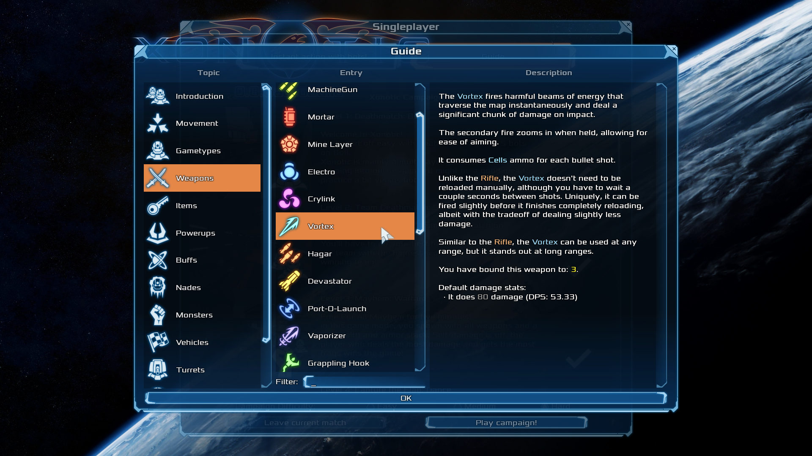
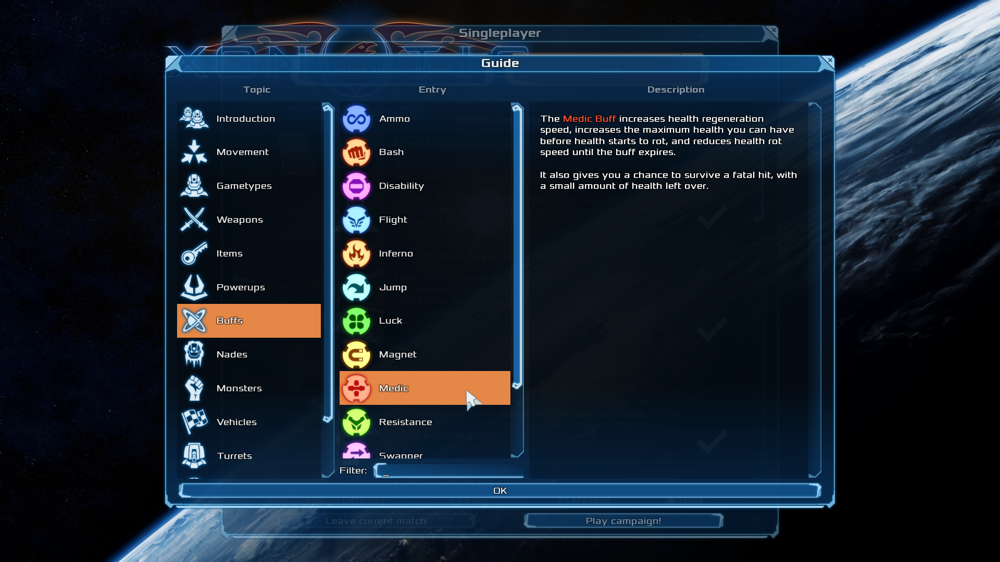
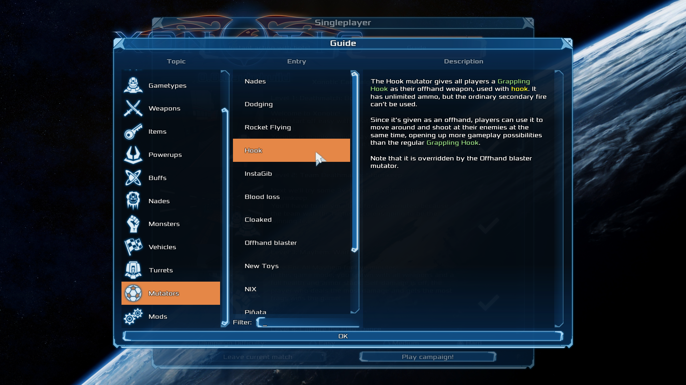
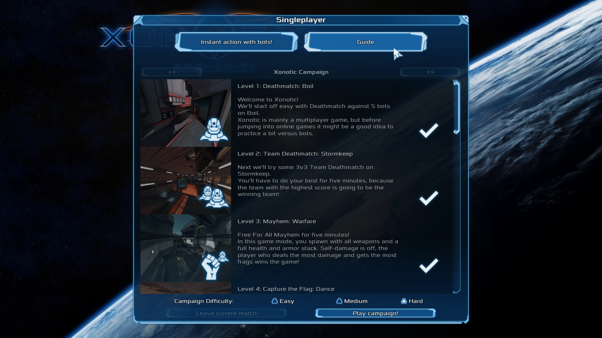

<!-- https://gohugo.io/content-management/summaries/ -->
After many hours of writing and refining the text entries, the in-game guide is finally here!
This guide intends to complement [Halogene's Newbie Guide][Newbie Guide], instead providing more focused information that gets down to the core details all players (newbies and veterans alike) should know.
[Update to autobuild][Updating] now to access it.
<!--more-->

The in-game guide is a project with a very long history.
Over a decade ago back in 2015 on the 17th of August, [TimePath][TimePath] opened the [guide merge request][Guide MR] on the main development Git repository.
Back then, it had a pretty well fleshed out framework and visuals, but the content itself was missing.

Since then, the project sat idle, receiving small improvements now and then, but nobody had yet taken on the daunting task of filling out all the information.
Late last year after joining [the team][Xonotic Team], I stumbled across the merge request and it caught my attention.
While the campaign is a great tool for new players to learn the ropes, I had always wondered why Xonotic had no in-game guide or tutorial, and I realized the potential of an in-game guide.
So I decided to take it on.

Now some nine months later, the guide is finally here!
It contains:
- A general introduction section
- Movement tips and tricks
- Gametypes (gamemodes)
- Weapons
- Items
- Powerups
- Buffs
- Nades
- Monsters
- Vehicles
- Turrets
- Mutators
- Mods (like XPM and Overkill)

To go over some of the sections briefly, each gametype, weapon, item, and nade entry contains a short description of how the mechanic works, but also tips for new players encountering it for the first time.
For example, weapon entries list statistics like damage per second, but they also highlight when and how a weapon shines.
Here's the Vortex entry:

    
  *click to view full size*

Here's the Medic buff's entry:

    
  *click to view full size*

Xonotic has many mutators and unfortunately the guide would be overly complex if it covered them all, so it focuses on only the most common ones.
Here's the Grappling Hook mutator's entry:

    
  *click to view full size*

And last but not least, the guide is currently located in the Singleplayer menu:

    
  *click to view full size*

To get the guide, you'll have to [update to autobuild][Updating] first.
If you've never heard of them before, [autobuilds][Autobuilds] are "beta" releases that contain live changes pushed by the developers in between major releases.
They're an easy way to play the latest development version without having to compile the game yourself, and the current autobuild has many new features and fixes along with the guide.  

More information on how to upgrade is linked above, but basically:
- Linux or macOS: run `misc/tools/rsync-updater/update-to-autobuild.sh` in your Xonotic install location, or
- Windows: run `misc/tools/rsync-updater/update-to-autobuild.bat`

If you're interested in translating the guide into your language (or any of the other text in the game for that matter), be sure to check out [the translation guidelines][Translation guidelines].

Huge thanks to:
- [TimePath][TimePath] for starting the project up and creating the core guide menu window,
- [terencehill][terencehill] for improving some entries and entry sorting, making the text more easily [translatable][Translating], and review & merging,
- [Halogene][Halogene] for adapting his [newbie guide][Newbie Guide] into parts of the guide,
- [Mario][Mario] for keeping the merge request up to date while nobody else was working on it, writing the Monsters entries, for some miscellaneous jobs,
- [Antibody][Antibody] for adding the XonStat entry,
- [MxCrab][MxCrab] for making the XDF guide,
- [Dr. Jaska][Dr Jaska], [SpiKe][Spike29], [bones_was_here][bones_was_here], [5225225][5225225], and [andreymal][andreymal].

Happy Xonning!

[Guide MR]: https://gitlab.com/xonotic/xonotic-data.pk3dir/-/merge_requests/181
[Newbie Guide]: https://xonotic.org/guide/
[Xonotic Team]: https://xonotic.org/team/
[Updating]: https://xonotic.org/download/#upgrading
[Autobuilds]: https://gitlab.com/xonotic/xonotic/-/wikis/Autobuilds
[Translating]: https://gitlab.com/xonotic/xonotic/-/wikis/Translating
[Translation guidelines]: https://gitlab.com/xonotic/xonotic/-/wikis/Translation-guidelines
[TimePath]: https://gitlab.com/TimePath
[terencehill]: https://gitlab.com/terencehill
[Halogene]: https://gitlab.com/halogene
[Mario]: https://gitlab.com/Mario
[Antibody]: https://gitlab.com/Antibody
[MxCrab]: https://gitlab.com/MxCraven
[Dr Jaska]: https://gitlab.com/drjaska
[Spike29]: https://gitlab.com/SpiKe
[bones_was_here]: https://gitlab.com/bones_was_here
[5225225]: https://gitlab.com/5225225
[andreymal]: https://gitlab.com/andreymal
