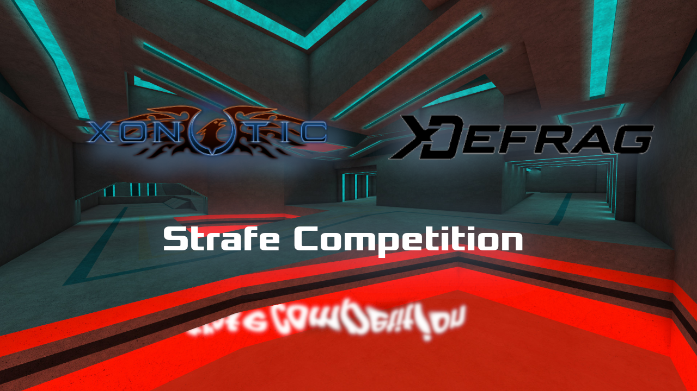

<!-- https://gohugo.io/content-management/summaries/ -->
Hello, hello hellohello, after 5 weeks of exceptional competition across 5 exellent maps by Kool, we have the extraordinary recap of the 2026 Xonotic Strafe Competition! 
<!--more-->

MxCrab here with the DeFraG/CTS community to share a little tournament that just happened. First a small explainer of what our gamemode is.  
This is a Race mode known as DeFraG or CTS/Complete The Stage. The objective is to reach the finish as fast as possible, with nobody around to shoot you or get in your way. We use plenty of tricks to move faster, a lot are the ones you might see in pewpew modes but taken more to the extreme (and if you want to learn more you can [click here for the XDF guide I made](https://xdf.gg/guide) wink wink, nudge nudge). On some maps we use weapons, but for this tournament Kool had set us up with 5 phenominal strafe only maps (no weapons, just pure running). Join me as we go through the 5 strong weeks of competition and crown our champion. 

 
 
# Round 1
The first round was an Egyptian styled map with a few routes to choose from, where snowballing your speed really mattered. If you'd like some extra curricular viewing then [my beginners route guide for the map can be seen here](www.youtube.com/watch?v=kGszbyj-1kg), otherwise I'll explain in text the primary routes taken. 

