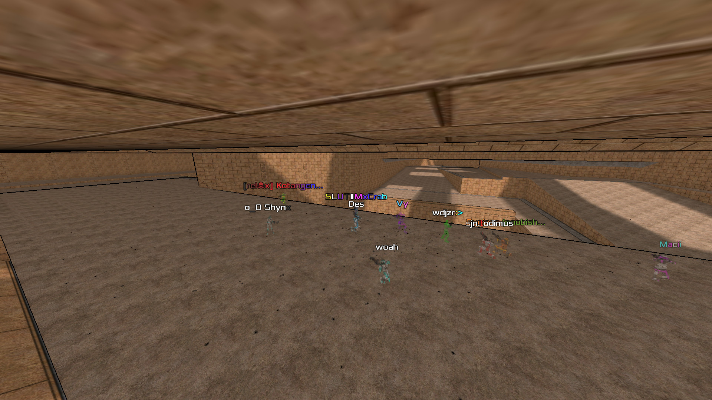
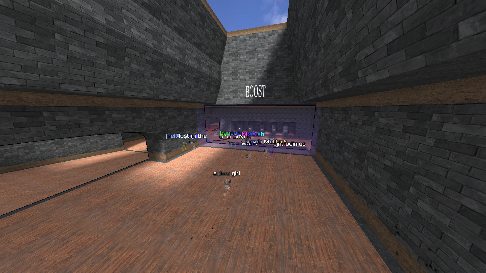
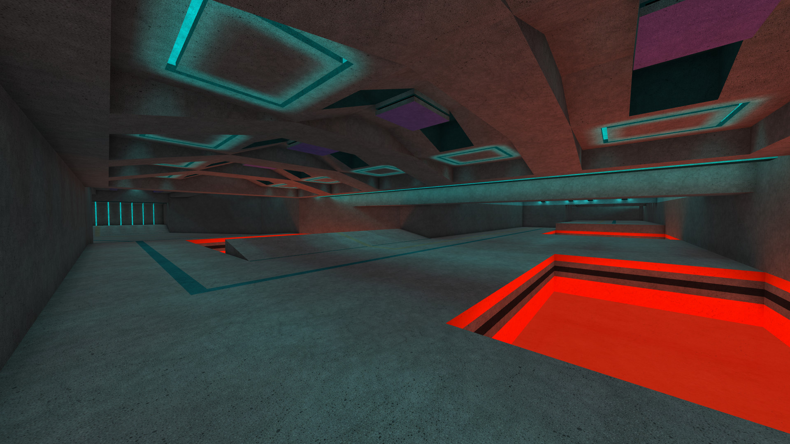
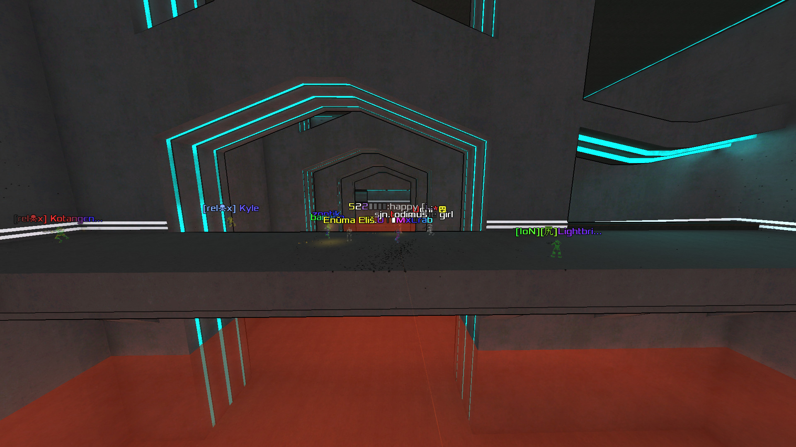

<!-- https://gohugo.io/content-management/summaries/ -->
Hello, hello hellohello, after 5 weeks of exceptional competition across 5 exellent maps by Kool, we have the extraordinary recap of the 2026 Xonotic Strafe Competition! 
<!--more-->

MxCrab here with the DeFraG/CTS community to share a little tournament that just happened. First a small explainer of what our gamemode is.  
This is a Race mode known as DeFraG or CTS/Complete The Stage. The objective is to reach the finish as fast as possible, with nobody around to shoot you or get in your way. We use plenty of tricks to move faster, a lot are the ones you might see in pewpew modes but taken more to the extreme (and if you want to learn more you can [click here for the XDF guide I made](https://xdf.gg/guide) wink wink, nudge nudge).  
This mode also has some physics changes to uncap speed, change acceleration, and let us do double jumps, more ramp jumps, and a few other cool tricks. Come give it a go!  
On some maps we use weapons, but for this tournament Kool had set us up with 5 phenomenal strafe only maps (no weapons, just pure running). Join me as we go through the 5 strong weeks of competition and crown our champion. 

 
 
# Round 1
The first round was an Egyptian styled map with a few routes to choose from, where snowballing your speed really mattered. If you'd like some extra curricular viewing then [my beginners route guide for the map can be seen here](www.youtube.com/watch?v=kGszbyj-1kg). It was a great map for those who could see the future, and figure out what spacing would happen if only they pushed a *tiny* bit harder. 

I very much want to thank and talk about everyone who played this tournament, but we have to cut it off somewhere, so I'll try to call out highlights. In the weekly review streams I cover the top 20 + any continental bests outside the top 20. In the early top 20 we saw a few different routes, as people were able to optimise a weaker route better, or pull off a weaker run on the stronger route. It was tight between lines this week for sure. 

An interesting comparison was the difference between Uchi and other runs. Uchi was much faster than those around him, but took a wider line. The next 4 runs, and 2 prior, were slower average speeds than his.  
One of the coolest tricks we saw was a spacing adjustment at the end from jhheight where he got a double jump from the inside line to the outside ledge going into the final 90* corner. He did this so he could get around that corner with the spacing to not eat the upramp and to not smash into the wall on the outside. It worked very well, but that strat didn't last long as the next runs would get just fast enough to do -1 jump for spacing adjustment.

woah showed us the perfect end jump, losing so little speed it almost felt like he didn't hit the ramp, while Kablaa showed us how sketchy it could get towards the end as he nearly missed the final ramp (despite knowing these are the best runs, I still get scared someone will miss a jump, or hit a wall)

To open us up the top 5 was source, the big talking strafer who inspired this tournament, Shynx in 4th, a tight strafing route with a nice end and a very hard grinder, woah one of the cleanest strafers in the game and with amazing AD tight turns, frostie in 2nd with a few nice tricks in his route and some very tight lines, and taking the win was the mighty goblin, a full 0.36s faster than 2nd place. That might not sound like a lot but another 0.36s takes us from 2nd to 7th.   

It was a big gap made with some impeccable downramps to gain more speed than other players, and a bit of wizardry with a DJ cancel (a trick to stop you from double jumping in certain situations where it makes it faster). 

### R1 Secrets
All 5 maps had 4 secrets on them to find. On this map they were reasonably easy to find, and a few people, myself included, decided to try and speedrun all secrets. Kotangens did this for all maps and his videos will be linked so you can look at them. My favourite secret on this map is the 3rd one, possibly the least entertainingly hidden, but I liked how many people went "oh wow" in shock when they realised the water was visual only and had no physics. 

### Round 1 Video Links
[Kotangens Secrets](https://www.youtube.com/watch?v=iMPIet0ez1k)  
[Route Guide](https://www.youtube.com/watch?v=kGszbyj-1kg)  
[Top 20 Records](https://www.youtube.com/watch?v=feJFZ-p0SZY)  
[Morosophos Top Runs](https://www.youtube.com/watch?v=Ci85kXQGlro)  
[Round Results](https://xdwc.xdf.gg/xsc/map/xsc2026-round1/)

# Round 2

This round had many routes, but sometimes one route reigns supreme. We were unsure whether one would for a short while, until an unfortunate trick was discovered.  
Of the 3 routes out the start you could drop down behind to hit some major slick patches, exiting the first room with over 2300ups, though this would lose the Speed powerup (an extra 30%ish speed gained). You could go straight out on a tight line down a ramp and hit a small slick patch, a good route of this was the fastest first room exit, but with the least speed (keeps Speed though), and finally you could take a booster panel slightly wider from the small slick patch. This kept Speed, was a bit faster than the small slick, and was in between the other two on first room exit time.  
Unfortunately this wall of booster could be hit twice, exiting the first room slightly slower than the tightest line, but with 2200+ speed and keeping Speed. 

The rest of the map was a high speed afair with an empahsis on tighter lines and not losing speed on the ramps. It was a tough balance between perfect ramps, and getting high enough to get over the end. 

The Turkish Delight, wdjzr enthralled us this week getting himself a 14th place. He had pixel precision on the 2nd room ramp, and a lovely smooth turn through the final corner being able to get a good strafe in towards the finish. 

Kyle impressed this week, taking very tight lines and grazing walls on his way to 13th place. Avoiding the step at the end just barely, giving us a moment of worry (forgetting that these are pre-recorded best runs)

Just before the top 5 we saw a route change in the 3rd main room, going from a tight line inside off the right ramp, to going for a wider line still off the right ramp, or as would turn out to be fastest, taking the shallower left ramp, then a very gentle second ramp giving great spacing to clear a gap that I was SURE would result in a head hit without crouching at some point (but all these brave strafers held their nerves and never crouched, honouring the spirit of Xonotic being made on the Q1 engine)

delta opened up the top 5, just 0.02 slower than Shynx. These two took different lines through the third room, and were close elsewhere, showing how tight the margins are. The left hand line just had a little more space to get faster, showed by frostie in 3rd having slightly poor spacing into the lava gap jump. woah showed us his amazing AD skills on the final two corners of this map, before goblin came in to shut down the party 0.15s faster than woah (not as demolishing this time, that time again takes us from 2nd to 6th place)

Strafe maps can be a very simple afair, but to make time you have to study the minute details of the maps. The changes goblin made were slight, and can't be seen on first viewing, but when put together make a great difference. 

### R2 Secrets
The secrets on this map were tougher to find than map 1. The first being hidden right at the start, under the overlap between top and bottom routes got me good. I found secret number 2 with a big gap from the 2nd room jump and wondered where on earth number 1 could be. Kota managed a great run on this one, with a few of the jumps being a bit tricky to get all in one go. 

### Round 2 Links
[Kotangens Secrets](https://www.youtube.com/watch?v=qJEMVa8cmFU)  
[Route Guide](https://www.youtube.com/watch?v=kGszbyj-1kg)  
[Top 20 Records](www.youtube.com/watch?v=sIeUL1NOvKY)  
[Morosophos Top Runs](https://www.youtube.com/watch?v=G_Umm3kfAv8)  
[Round Results](https://xdwc.xdf.gg/xsc/map/xsc2026-round2/)  

# Round 3
This round gave us slower speeds, concrete walls, and two obvious lines that could be crossed between. A generally slower but easier blue line, and a faster but more technical yellow. This map was great for beginners wanting to slowly test their skills and improve their lines. At any point you could easily swap back and forth, just doing one trick better could save seconds on the run. For the top players taking the fastest lines this map was surprisingly hard on the spacing, and required a lot of thinking about where to land on each ramp to ensure you'd be good for the next, or not crash into a step.  
Tight lines, clever spacing, and brave deep strafes were the order of the day. 

A legendary mapper in the community, ash, who often doesn't compete in the main Xonotic Defrag World Championship due to having made maps, blessed us with a fantastic show of his skills (part of what makes him such a good mapper). He's been performing well all tournament but a step into the top 10 is always great. His near perfect sideways ramp into the final checkpoint was a key part of his time, carrying more speed than others around him. He followed that by being fearless and staying full on the ~~gas~~ strafe into the finish. 

Vert dropped in 6th place, showing off a few really technical tricks in the middle. Taking a double jump instead of a ramp at 14s into his run, he then DJ cancels the next step after the drop to get perfect spacing to land on a small ramp used to guide players up and around from the yellow path, giving him a fairly large speed boost (~100ups) and then continuing his way. A fairly quiet event for Vert, but his shotgun slapping ways lift our spirits. 

delta once again opens out top 5 with a 38.74, just 0.03 ahead of Shynx, both of these players using almost identical routes to each other. frostie brought us back to the inside route on checkpoint 3, while woah showed us how good he could take a tight turn, taking a very late wide line into checkpoint 3. goblin decided that last week was too close for comfort and smashed everyone with a 38.14s time, 0.45s faster than woah in 2nd place. The gains he made in the 2nd last checkpoint were incredible. Perfect landings for each ramp, something that requires near perfect strafing and lines to make up, he very nearly clips a step in checkpoint 7 but holds on just about, finishing a fantastic run, making it look easy. 

### Round 3 Secrets
Some more difficult to access secrets this week, with one situated in checkpoint 3 requiring a good run up, well placed spacing, and a ramp off a tiny diagonal ledge at the back of the room to get you up to the teleporter spot. Kota is very good at these as often they're used on pewpew maps to get to powerful items faster than others. He of course did all of the tricks with ease! 

### Round 3 Links
[Kotangens Secrets 3](https://www.youtube.com/watch?v=NWdCtHTS3-4)  
[Route Guide](https://www.youtube.com/watch?v=W2py-4d6AnQ)  
[Top 20 Records](https://www.youtube.com/watch?v=pWJc7n-8aR4)  
[Morosophos Top Runs](https://www.youtube.com/watch?v=1Kid46SrDto)  
[Round Results](https://xdwc.xdf.gg/xsc/map/xsc2026-round3/)  

# Round 4
The map idea that inspired this whole tournament, when source asked Kool to make a map using shotgun buttons. These are buttons you can shoot with the shotgun that give knockback to the player in a certain direction, allowing you to push them up, down, forwards, backwards, diagonally, and generally make some pretty cool routes. 

nihlo joined us from WarSow race and in their first week playing got a top 20 time, putting in 19th place. They made great AD turns and looked comfortable switching from strafing to aiming at the targets. 

In the big centre room with two targets, one on entry (pretty much mandatory to hit at these speeds to clear the gap faster), and one on exit (that had to be flicked back for, to reach an upper path), there was a bit of a back and forth between best routes. Some players opted to shoot both buttons, clearly the faster of the two routes (as exiting the upper path landed more speed from a downramp) but others didn't feel comfortable getting strafes in with the flick, or making the corner after, so shot only the first button and stayed low. This worked well for KristiDonk, who continues to impress since coming onto the scene in XDWC2025. 

After a while it became clear the end part of the run, with a harsh drop down a chute with a push button at the top, and a ramp at the bottom was key to speed and a lot of timesave on this map. You needed to preserve some horizontal momentum in the chute, as hitting the wall would result in 1500ups exiting, but a good diagonal across could net over 1800.  
Uchi was one of the first to employ the double shot super effectively, getting out with 2100ups from the chute! It was clear in the section after, across a tight bridge turn, that he'd been here a few times before as he didn't panic and knew his spacing would work out to get into the finish with style. 

One of the hardest parts of this was shooting the second shot after hitting a push pad that reset vertical velocity. It was tight margins, but if you knew the timing of the first shot, you could keep the shot pressed and make the reload time do the work. 

woah was unable to continue his great run of top 3 placements, but still opened up our top 5 this week. He'd struggled to make good use of all the button tricks, and was definitely showing that in the Twitch chat.  
Shynx showed us again that you can't put nice scenery in a map, lest it be abused, by using the shotgun up pushers early to head hit and get a head hit reverse downramp push (these terms are getting hard to describe, as Jaska will complain about with the "DJ cancel" term).  
delta tried something very special into the slick room, but was had by the randomness of the shotgun! At around 28s he tried to 180 flick and shoot the target again to go directly to the slick. Unfortunately the randomness failed him and he missed, and lost strafe at the same time. Still a great finish, and he's always reliable to show off something cool and unique.  
frostie was surprised his time was second after seeing everyone else's runs, but a clean run implimenting all previous strats well was enough to secure second place. 

goblin's run was something else here though. 0.66s ahead of 2nd place, a monumental gap here. At 8s in he shoots the target 3 times, as others have done, but he's brave as anything and waits for the crosshair to overlap the target instead of moving his aim. This is exactly what's taught in pewpew school, and it works here to let him keep strafing further than anyone else!  
During the drop chute he shoots the target for a second time on nearly the last possible frame before it disappeared from view and exits with an incredible 2300+ups. What's possibly more impressive is how fast he gets back on the strafe after this, and then casually hits the final target to drop into the finish. 

### Round 4 Secrets
This round included an extra special secret, a hardcore parkour style map for the 4th card. This map has been released as xsc2026-round4-secret on the servers, if you want to give it a go. It's tough, and Kota makes it look easy!  
The rest of the secrets are very well hidden too, one requiring a few button presses to get on top of the building, another needing you to drop carefully between invisible teleporter planes and then leap across beams, and another one that's so well hidden I've forgotten where it is! 

### Round 4 Links
[Kotangens Secrets](https://www.youtube.com/watch?v=gJbBZUddAw4)  
[Route Guide](https://www.youtube.com/watch?v=5T5d5zTy4gY)  
[Top 20 Records](https://www.youtube.com/watch?v=s46Qb_lRXQ4)  
[Morosophos Top Runs](https://www.youtube.com/watch?v=7tG3MzhGJzU)   
[Round Results](https://xdwc.xdf.gg/xsc/map/xsc2026-round4/) 

# Round 5 

The final round, and the final chance for contestants to secure their overall placements. Some placements were fairly set in stone with a few hundred points between places, but others it was down to the absolute wire! Vert and source went into this round just 1 point apart, and Uchi and qutebones were tied! It's very rare to see things that close. 

This round was the longest, and possibly hardest, of the tournament. A fast wide open map, with plenty of lines and routes to pick from. We were certainly going to see some different routes in the top 10 this week. One of the key moments was a set of steps, fairly tricky to figure the spacing to get up in the first place, but taking the following corner tight was a difficult thing. That then led to a ramp over into two slits in the floor, carrying speed into the next rooms. 

Des, our beloved admin and cheat provider, managed to up his performances and get a top 20 position. Forever the South American continental champion, but for the first time solidly into the top 20 in 19th place. He just really liked the map this week. 

jhheight put in his 9th place finish, and rage quit the game. If you're reading this jh, we miss you, it's okay, please come back, we promise we won't play this map again if you're around <3 

Tu, who up to this point has gone under the radar in this write up coverage, but was introduced on the first 3 demos by the game itself, had been quietly having good runs every week and keeping a high placement in the overall. He slotted into 5th place this final week. Tu had previously impressed with some HUGE W turns through round 3, and was once again back showing how powerful the W turn is in Xonotic (with Speed you gain as much accel as a perfect AD turn, but you've got to be skilled and brave to pull it off). The tactical butt wall touch at Checkpoint 4 to get spacing for the big gap was impressive. 

woah showed us how lightly you can scrape sideramps to get up on top at checkpoint 2, powering his way into 4th place. After the large pillars room woah grazed the walls of the next room, and the confidence through the tricky chicane final bend was mighty. 

frostie switched the routes up a little at the start. He set the fastest time to checkpoint 1, and had the shortest overall distance of anyone for the whole map this week. The shorter line was a risk, due to having less speed, but frostie decided he could have the shorter route AND the speed, and made it work. 

Having had the first time under 1 minute, set only a few hours after the round started (only 8 players at all went under 1 minute here), Shynx got himself 2nd place, his best performance on a round. A huge chunk ahead of frostie, and the biggest gap between two players in the top 20. He took a strong route at the start giving him a lot of speed through checkpoint 2. He skipped gracefully up the steps at checkpoint 4, and flew beautifully on the tightest line through the pillars. 3000 speed through the final chicaines was scary to watch. 

Despite all that, and being pushed hard this week, goblin would reign supreme over us all. 5 out of 5 in this tournament, and now on a 14 round in a row win streak since dzy beat him in XDWC2024-1.  
It may not have been unexpected, but he certainly rose to the occasion. His gentle side ramp jump through into checkpoint 2, and the spacing adjust DJ cancel stepup for checkpoint 4 are the kinds of things that are almost impossible to notice at full speed, but they make all the difference in these events! 

### Round 5 Secrets
The secrets on this round were very cool (or kool, if you prefer). The third secret was well hidden in the pillar room, and Kota entered it with a nice backwards strafe. The 4th secret was apparently the hardest bonus track of any of the secrets. I wouldn't know, I couldn't find it, or finish the easy ones. Secrets being great maps in their own rights is what makes these 5 maps from Kool all the more special. 

### Round 5 Links
[Kotangens Secrets](https://www.youtube.com/watch?v=-sH_267hQJo)  
[Route Guide](https://www.youtube.com/watch?v=jmtAHH4wlno)  
[Top 20 Records](https://www.youtube.com/watch?v=V1u_G0wwIB4)  
[Morosophos Top Runs](https://www.youtube.com/watch?v=_cGGTcDHoz0)  
[Round Results](https://xdwc.xdf.gg/xsc/map/xsc2026-round5/)

# The Overall Results
So, after 5 weeks of play, what does the overall look like? We had 344 players set a time across all the maps, which is an amazing number to see. 54 countries, 6 continents (if anyone knows someone who's out at the Antarctic research base in October or November so we can get all of them, that'd be amazing), and 748 total PBs (all players, all maps). 

Congratulations to every single player, no matter your time it means a lot to everyone who helps organise these events, so thank you for playing. 

The top spot, of course, with 5/5 wins, went to goblin. frostie managed a second place, staying consistently in the top 3 every week. woah kept himself just about Shynx for 3rd, and Shynx made sure to challenge woah for that top 3 in the end, getting much closer with the final round. delta rerouted his way into 5th, with Vert quietly behind. The inspiration of the tournament, source, picked up a nice 7th for his efforts. Tu was the first place gainer of the final round overtaking jhheight via his top 5 finish. With silny not playing the final round a lot of others moved up, Kyle managing to get the top 10, and in the fight between qutebones and Uchi, Uchi absolutely smashed it putting two places between them (ash taking the gap in between). 

In the continental side of things goblin of course took Europe, and source dominated every round for North America. wdjzr no longer needs his Asian continental champs medal to prop him up as he's a certified top 15 player, and Des toppled the South American leaderboards again and is on the up.  
The Oceania fight was fairly close some weeks between khanate and Paul, with khanate taking the overall and all rounds except Round 4 where Paul put in a great run, beating khanate by 0.1s.  
The African title is often an uneventful afair with random players dropping in from here and there, OutrageousNoise59 put in a run on Round 1 showing us that brand new players can play these maps and look competent, but they never returned. Round 2 went without Africa, but from Round 3 onwards we had TOMATO competing and improving, going from that "first run, complete beginner" in round 3, up to a very competent run, doing a lot of the big tricks that save the most time. From outside the top 100 on round 3 to well within it finishing in the 70s on 4 and 5. Overall 102nd, I'm sure we'll see them in the top 100 next event. 

Through out the rest of the leaderboard we see battles between people, and it's great to see rivalries form on the leaderboards, especially knowing that some of my best friends in this game have been formed because we were constantly near each other in XDWC rounds. 

### Kools Message To Players
Thank you to everyone who played the maps i made. I really hope you enjoyed the event and had fun. It was such a pleasure to watch the different routes you guys did on the maps.
A big thanks to the guys behind the scene such as Woah, Moro, Mirio, MxCrab, Hyphonical, ash, amino. Special thanks to source for pushing me to make this event and a map like round 4.
Once again, Thank you very much everyone and have a great week-end.

[Results Page](https://xdwc.xdf.gg/xsc/)  
# CrabCup XSC Special Event
And now, for something a little different.  
Every other week on a Thursday evening since the start of this year I've been running mini competitions (you can find out [more information here](https://forums.xonotic.org/showthread.php?tid=10103)). For this week after XSC I decided to see who could battle hardest with only 20 minutes to set a time on each map. 

It was a tough competition, since everyone had to play hard for over an hour and a half. By the end it was definitely endurance based. 

Of course, being a live event, not everyone could show up, but those that did proved that performance in the main event mostly translated to performance after, and interestingly not so many routes were changed, even after seeing the best runs from the top players and knowing all the tricks. 

The results are here:  

-and the [video of the event is here](https://www.youtube.com/watch?v=VHXISCtr9ig&list=PLIiLNY1jJwloZ1xE6cHsCdJVA63dEZK_3&index=1)

# Where to find us! 
If you've got this far, surely you owe it to yourself to hop online and play with us! We don't bite (unless asked).  
A guide to playing this wonderful gamemode [can be found here](https://xdf.gg/guide), but just joining the servers and playing is perfectly fine. There are multiple servers to pick from. Look for the `exe.pub` servers in CTS mode. There's Relaxed Running for easier maps with 20 minute time limits, and Respect the Grind for those same maps but longer time limits for bashing out the perfect run.  
Hardcore Parkour is where the tricky torture style maps go (and longer maps, it's not all super hard), and we even have a hook race and Vanilla Quake 3 physics servers if you prefer those.  
All the chats are linked together, and even bridged to IRC with #clanexe on QuakeNet, so whatever server you're playing there's always some company. 

Morosophos, our wonderful admin, posts automatic world record videos to [his channel here](https://www.youtube.com/@morosophosxon2836), and I take those videos and commentate over them every month [for my channel here](https://www.youtube.com/@MxCrab).  
Tournament information is posted over on the Xonotic forums, but history and live info for all events is on https://xdwc.xdf.gg and all runs on regular servers get uploaded to https://xdf.gg so you can see your place on the leaderboards and climb that ladder! 

Thank you so very much for coming along on this journey, I hope you enjoyed the tournament, and that we'll see you on the servers soon! Have a good timezone, and cya! - MxCrab